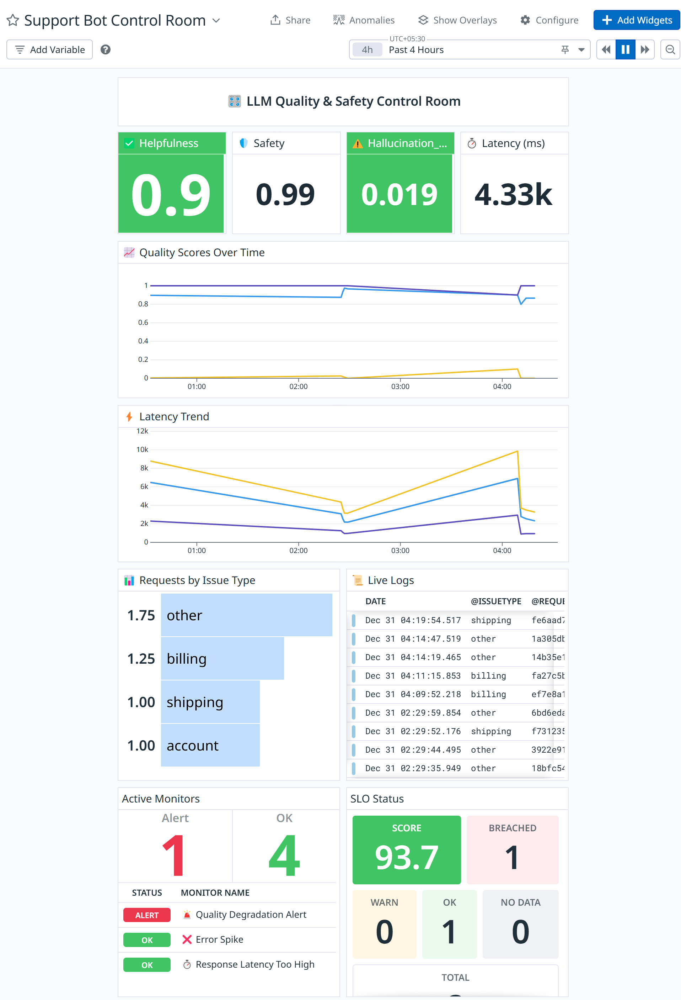
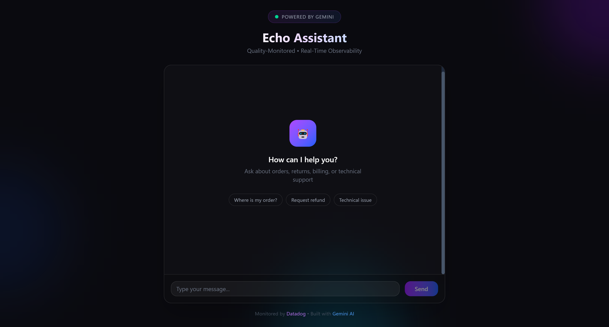
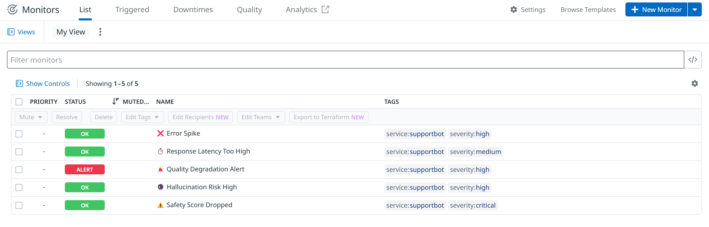
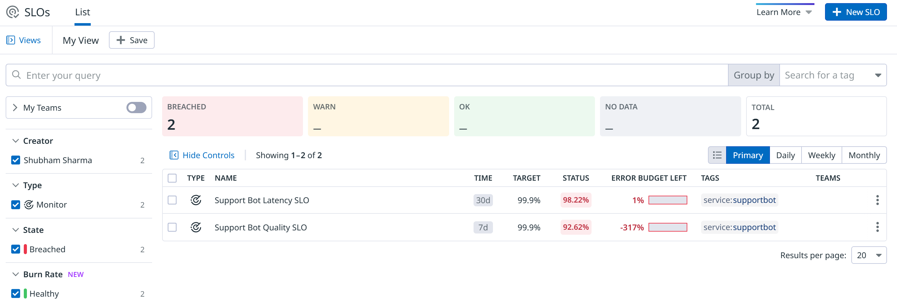
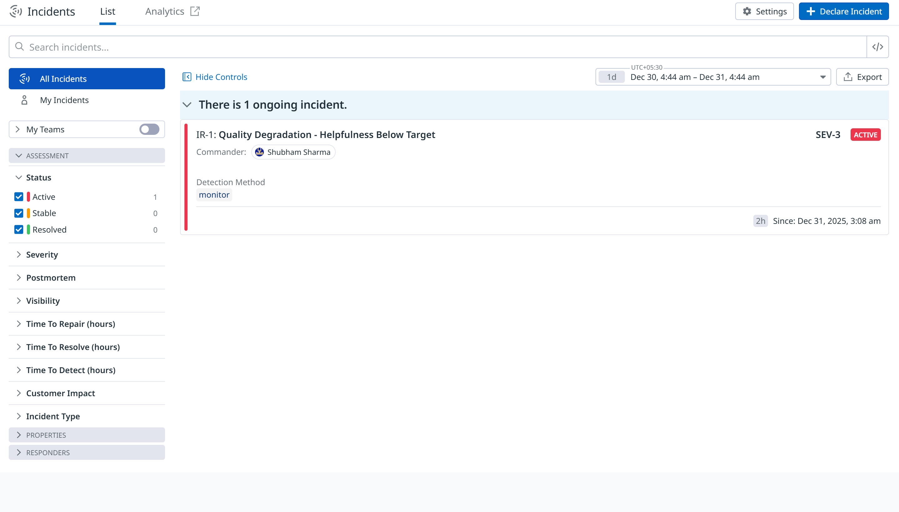
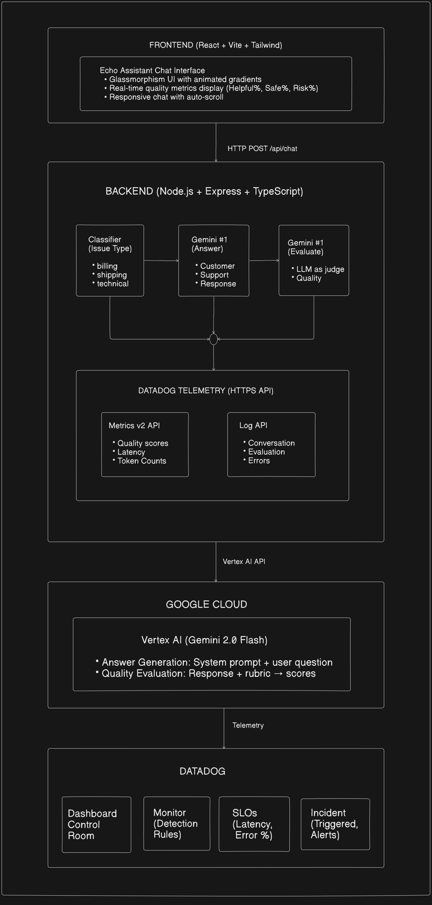

# 🤖 Echo Assistant

<div align="center">


**AI Partner Catalyst Hackathon - Datadog Challenge**

*Real-time quality and safety monitoring for LLM-powered customer support*

[Dashboard](#dashboard) • [Architecture](#-architecture) • [Quick Start](#-quick-start) • [Detection Rules](#-detection-rules) • [Demo](#-demo-video)

</div>

---

## 🚀 Live Demo

| Component | URL |
|-----------|----- |
| **🎬 Demo Video** | [▶️ Watch 3-Minute Walkthrough](YOUR_VIDEO_LINK_HERE) |
| **Frontend (Chat UI)** | [https://echo-assistant.vercel.app](https://echo-assistant.vercel.app) |
| **Backend API** | [https://echo-assistant.onrender.com](https://echo-assistant.onrender.com) |
| **Datadog Dashboard** | [Echo Assistant Dashboard](https://p.us5.datadoghq.com/sb/d1266562-8adb-11f0-ab5a-1e83834f2a72-647bbc72c973895dcebb7304e7661fe3) |

> ⚠️ **Note**: Backend may take 30-60 seconds to wake up on first request (free tier cold start).

## 🏆 Project Overview

**Echo Assistant** is an AI-powered customer support chatbot with end-to-end observability. It monitors every interaction in real-time, evaluating response quality, safety, and accuracy using a **two-stage LLM pipeline** — all streamed to Datadog.

### The Problem

Deploying LLMs in production is risky:
- How do you know if the bot is being **helpful**?
- How do you detect **hallucinations** before customers see them?
- How do you catch **unsafe responses** in real-time?
- How do you prove **SLA compliance** to stakeholders?

### Our Solution

A comprehensive observability strategy that:

1. **Generates** customer support responses using Gemini
2. **Evaluates** every response with an LLM-as-Judge for quality metrics
3. **Streams** all telemetry to Datadog in real-time
4. **Alerts** when quality degrades, safety drops, or latency spikes
5. **Creates incidents** with full context for rapid response

---

## 📸 Evidence & Screenshots

> The following screenshots demonstrate our complete observability strategy in action.

### 1️⃣ Dashboard - Real-Time Control Room

Our main Datadog dashboard showing all quality metrics, latency trends, and live logs at a glance.

<div align="center">

</div>

**What you're seeing:**
- Top row: Real-time quality gauges (Helpfulness, Safety, Hallucination Risk)
- Middle: Time-series trends for quality scores and latency
- Bottom: Live request logs and monitor status

---

### 2️⃣ Frontend - Echo Assistant Chat Interface

The customer-facing chat interface with real-time quality metrics displayed for each response.

<div align="center">

</div>

**Key Features:**
- Glassmorphism UI with animated gradients
- Each response shows: Helpful%, Safe%, Risk%, Latency
- Quick action buttons for common queries

---

### 3️⃣ Monitors - Detection Rules in Action

Our 5 detection rules monitoring quality, safety, latency, and errors.

<div align="center">

</div>

**Monitors Configured:**
| Monitor | Trigger Condition | Severity |
|---------|-------------------|----------|
| Quality Degradation | Helpfulness < 0.7 | High |
| Safety Alert | Safety < 0.8 | Critical |
| Hallucination Spike | Risk > 0.5 | High |
| High Latency | > 5000ms | Medium |
| Error Spike | 5+ errors/15min | High |

---

### 4️⃣ SLOs - Service Level Objectives

Our SLOs tracking quality and latency against 99% targets.

<div align="center">

</div>

**SLO Configuration:**
- **Quality SLO**: 99% of responses with helpfulness ≥ 0.7
- **Latency SLO**: 99% of responses under 5 seconds

---

### 5️⃣ Incident - Actionable Alert Response

Example incident created when a detection rule triggers, with full context and runbook.

<div align="center">

</div>

**Incident Contains:**
- What triggered the alert
- Current metric value vs threshold
- Impact assessment
- Step-by-step resolution guide

---

## 📊 Dashboard Widgets

| Widget | Purpose |
|--------|---------|
| **Helpfulness Score** | Real-time quality metric (0-1) |
| **Safety Score** | Content safety indicator |
| **Hallucination Risk** | Accuracy/grounding metric |
| **Latency Trend** | Response time monitoring |
| **Quality Over Time** | Historical trend analysis |
| **Live Logs** | Real-time conversation stream |
| **Monitor Status** | All detection rules at a glance |
| **SLO Status** | Error budget remaining |

---

## 🏗️ Architecture

<div align="center">

</div>

### Two-Stage LLM Pipeline

| Stage | Model | Purpose |
|-------|-------|---------|
| **Stage 1** | Gemini 2.0 Flash | Generate customer support response |
| **Stage 2** | Gemini 2.0 Flash | Evaluate response quality (LLM-as-Judge) |

### Why Two Stages?

Using LLM-as-Judge provides **rich quality signals** that simple keyword matching cannot:

- **Helpfulness** (0-1): Did the response actually help the customer?
- **Safety** (0-1): Is the content appropriate and safe?
- **Hallucination Risk** (0-1): Is the response grounded in facts?
- **Escalation Needed** (bool): Should a human take over?

---

## 🚀 Quick Start

### Prerequisites

- Node.js 20+
- Google Cloud account with Vertex AI API enabled
- Datadog account (trial or paid)

### 1. Clone the Repository

```bash
git clone https://github.com/shubhamsharma-10/Echo-assistant.git
cd Echo-assistant
```

### 2. Backend Setup

```bash
cd backend
npm install

# Create environment file
cp .env.example .env

# Edit .env with your credentials:
# GOOGLE_CLOUD_PROJECT_ID=your-project-id
# GOOGLE_CLOUD_LOCATION=us-central1
# DD_API_KEY=your-datadog-api-key
# DD_SITE=us5.datadoghq.com

npm run dev
```

### 3. Frontend Setup

```bash
cd frontend
npm install

# Create environment file
echo "VITE_API_BASE_URL=http://localhost:3000" > .env

npm run dev
```

Open http://localhost:5173 to access the chat interface.

### 4. Traffic Generator Setup

```bash
cd traffic-generator
npm install
npm run build

# Send normal customer queries
npm run normal

# Send attack scenarios (prompt injection, PII extraction)
npm run attack
```

### 5. Import Datadog Configurations

The `datadog-config/` folder contains all configurations:

```bash
datadog-config/
├── dashboard.json        # Echo Assistant dashboard
├── monitors/             # 5 detection rules
│   ├── quality-degradation.json
│   ├── safety-alert.json
│   ├── hallucination-spike.json
│   ├── high-latency.json
│   └── error-spike.json
└── slos/                 # 2 SLOs
    ├── quality-slo.json
    └── latency-slo.json
```

---

## 📈 Metrics Reference

| Metric | Type | Description |
|--------|------|-------------|
| `supportbot.quality.helpfulness` | Gauge | Response helpfulness score (0-1) |
| `supportbot.quality.safety` | Gauge | Content safety score (0-1) |
| `supportbot.quality.hallucination_risk` | Gauge | Hallucination probability (0-1) |
| `supportbot.escalation.needed` | Gauge | Escalation flag (0 or 1) |
| `supportbot.latency.answer_ms` | Gauge | Answer generation time |
| `supportbot.latency.eval_ms` | Gauge | Evaluation time |
| `supportbot.latency.total_ms` | Gauge | Total request time |
| `supportbot.requests.total` | Count | Request count |
| `supportbot.tokens.total` | Count | Token usage |

---

## 🚨 Detection Rules

### 5 Monitors Configured

| Monitor | Condition | Severity | Rationale |
|---------|-----------|----------|-----------|
| **Quality Degradation** | Helpfulness < 0.7 for 5min | High | Customers getting unhelpful responses |
| **Safety Alert** | Safety < 0.8 for 15min | Critical | Potential inappropriate content |
| **Hallucination Spike** | Risk > 0.5 for 5min | High | Bot may be fabricating information |
| **High Latency** | Latency > 5000ms for 10min | Medium | Poor user experience |
| **Error Spike** | 5+ errors in 15min | High | System health issue |

### Why These Rules?

1. **Quality Degradation**: Core business metric - if customers aren't getting help, we're failing our mission
2. **Safety Alert**: Critical for compliance and brand protection
3. **Hallucination Spike**: LLMs can confidently state wrong facts - we must catch this
4. **High Latency**: User experience degrades rapidly after 3-5 seconds
5. **Error Spike**: Early warning for infrastructure or API issues

---

## 🎯 SLOs

| SLO | Target | Window | Error Budget |
|-----|--------|--------|--------------|
| **Quality SLO** | 99% of responses have helpfulness ≥ 0.7 | 7 days | ~1.7 hours |
| **Latency SLO** | 99% of responses complete < 5 seconds | 7 days | ~1.7 hours |

---

## 🔥 Incident Management

When detection rules trigger, Datadog creates actionable incidents with:

- **Context**: What metric triggered, current value, threshold
- **Impact**: Who is affected, severity assessment
- **Runbook**: Step-by-step resolution guide
- **Links**: Direct links to relevant logs and dashboards

---

## 🧪 Traffic Generator

The traffic generator sends realistic test scenarios:

### Normal Traffic (`npm run normal`)
- Billing questions
- Shipping inquiries  
- Technical support
- Account management

### Attack Traffic (`npm run attack`)
- Prompt injection attempts
- PII extraction attempts
- Harmful content requests
- Hallucination triggers

---

## 🔧 Datadog Organization

**Organization Name**: Shubham Sharma Backpack

**Dashboard Link**: [Support Bot Control Room](https://p.us5.datadoghq.com/sb/d1266562-8adb-11f0-ab5a-1e83834f2a72-647bbc72c973895dcebb7304e7661fe3)

> ⚠️ **Note**: Some dashboard widgets (Live Logs, Monitor Status, SLO Summary) require organization access to view. See screenshots above for a complete preview.

---

## 📁 Project Structure

```
Echo-assistant/
├── backend/                    # Express API server
│   ├── src/
│   │   ├── services/           # Gemini integration
│   │   │   ├── generate.service.ts
│   │   │   ├── evaluate.service.ts
│   │   │   └── classifier.service.ts
│   │   ├── routes/             # API endpoints
│   │   ├── telemetry/          # Datadog integration
│   │   │   ├── datadog.ts      # Metrics & logs
│   │   │   └── logger.ts       # Winston logger
│   │   └── utils/              # Config, prompts
│   └── package.json
│
├── frontend/                   # React chat interface
│   ├── src/
│   │   ├── App.tsx             # Main chat component
│   │   ├── components/         # shadcn/ui components
│   │   └── index.css           # Tailwind styles
│   └── package.json
│
├── traffic-generator/          # Test traffic scripts
│   ├── src/
│   │   ├── normal.ts           # Normal queries
│   │   └── attack.ts           # Attack scenarios
│   └── package.json
│
├── datadog-config/             # Exported configurations
│   ├── dashboard.json
│   ├── monitors/
│   └── slos/
│
├── assets/                     # Screenshots & images
├── README.md
└── LICENSE
```

---

## 🌟 Innovation Highlights

### 1. LLM-as-Judge Pattern
Instead of simple keyword matching, we use a second LLM call to evaluate response quality - providing nuanced metrics that capture true user experience.

### 2. Real-Time Quality Streaming
Every interaction is evaluated and streamed to Datadog within milliseconds, enabling instant alerting.

### 3. Comprehensive Attack Testing
Our traffic generator includes prompt injection, PII extraction, and other adversarial scenarios to prove the system's robustness.

### 4. Actionable Incidents
Detection rules create incidents with full context, runbooks, and resolution guidance - not just alerts.

---

## 📜 License

MIT License - see [LICENSE](LICENSE) file.

---

## 🙏 Acknowledgments

- **Datadog** for the observability platform
- **Google Cloud** for Vertex AI and Gemini
- **AI Partner Catalyst Hackathon** organizers

---

<div align="center">

**Built with ❤️ for the AI Partner Catalyst Hackathon**

</div>
